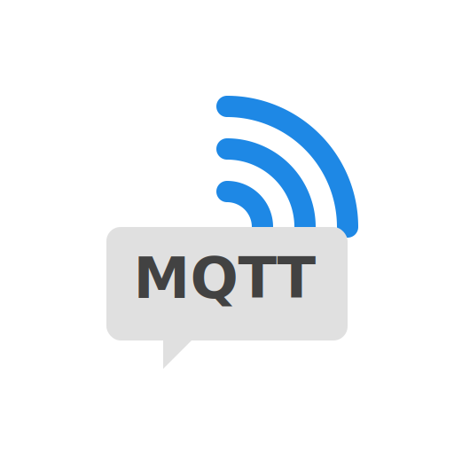
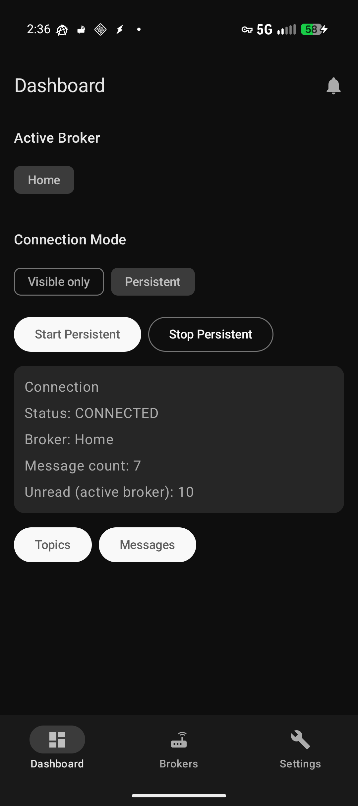
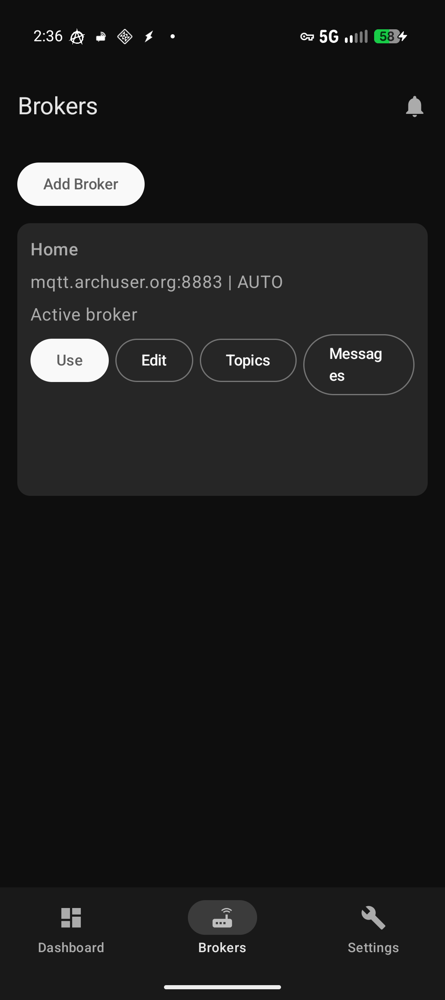
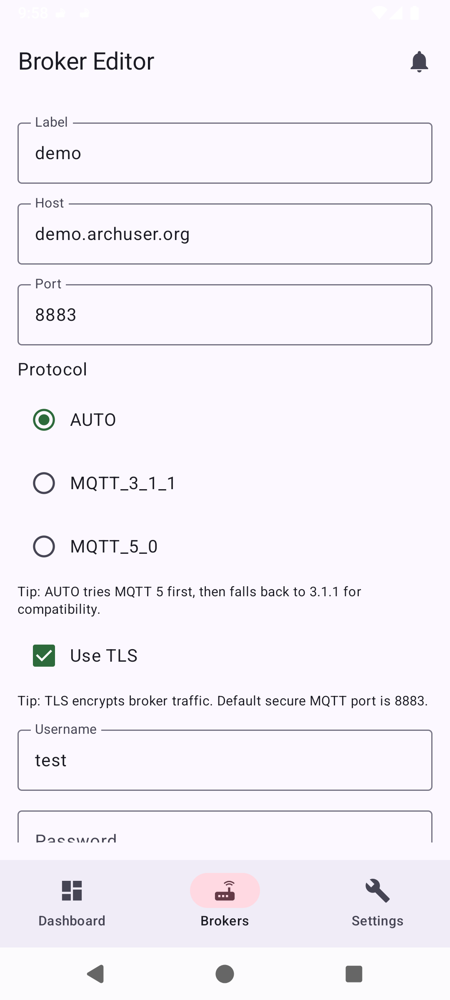
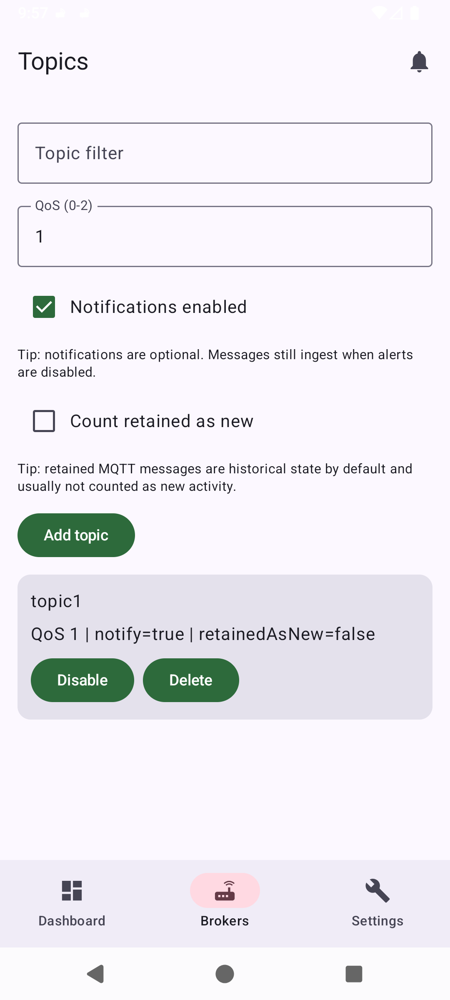
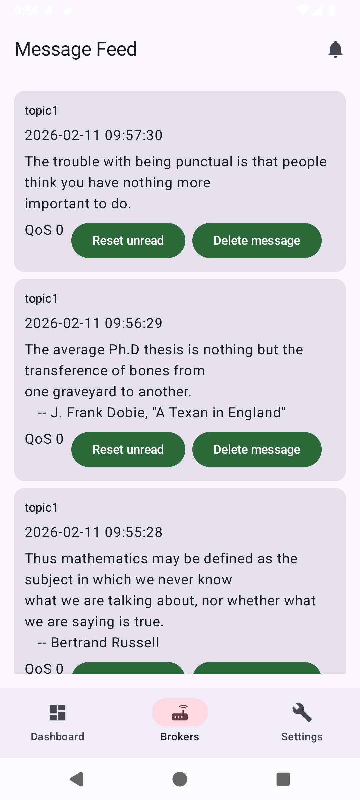
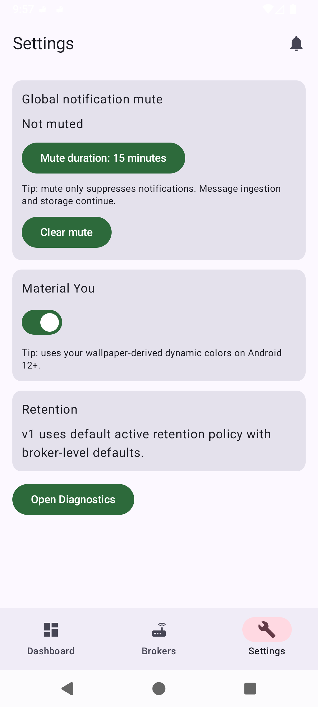
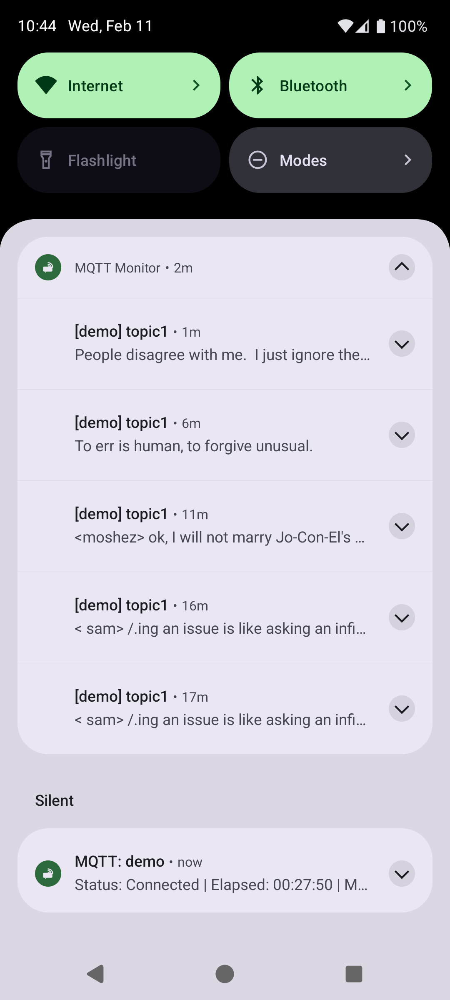

# MQTT Monitor



## Overview

MQTT Monitor is an Android MQTT client focused on message monitoring and notification delivery from user-managed brokers.

- Application ID: `org.archuser.mqttnotify`
- Language: Kotlin
- UI: Jetpack Compose
- Min SDK: 26
- Target/Compile SDK: 36

## Functional Scope

- Broker management (create, edit, delete, activate/deactivate)
- Broker validation (connection test required before save)
- MQTT protocol support: 3.1.1 and 5.0
- Optional TLS and username/password authentication
- Topic subscription management (QoS, per-topic notifications, retained-as-new behavior)
- Local message persistence and per-topic counters
- Per-message deletion and unread reset by topic
- Global notification mute with duration selection
- Material You enable/disable setting
- Diagnostics/event log view

## Connection Modes

### Active While Visible (`VISIBLE_ONLY`)

- MQTT connection is maintained while UI is visible.
- Connection is dropped when app is backgrounded.

### Persistent Foreground (`PERSISTENT_FOREGROUND`)

- MQTT connection is maintained by a foreground service.
- Persistent notification is required while active.

## Notification Behavior

- Message alerts use a dedicated high-importance channel.
- Foreground service status uses a separate low-importance channel.
- Global mute affects notifications only; ingestion and storage continue.
- Android system notification settings remain authoritative for final alert behavior.

## UI Reference Screenshots

The following screenshots document the current UI flows and states.

<details>
<summary>Dashboard</summary>



</details>

<details>
<summary>Broker List</summary>



</details>

<details>
<summary>Broker Editor</summary>



</details>

<details>
<summary>Topic Configuration</summary>



</details>

<details>
<summary>Message Feed</summary>



</details>

<details>
<summary>Settings</summary>



</details>

<details>
<summary>Notifications</summary>



</details>

## Architecture

Main source root: `app/src/main/java/org/archuser/mqttnotify/`

- `core/`: utility abstractions (time, dispatchers, topic matching)
- `connection/`: connection coordinator/state logic
- `data/local/`: Room entities, DAO interfaces, database
- `data/mqtt/`: MQTT adapter and connection test implementation
- `data/repo/`: repository implementations
- `data/security/`: encrypted credential storage
- `domain/model/`: app domain models
- `domain/repo/`: repository contracts
- `notifications/`: notification channels and dispatch
- `service/`: persistent foreground service
- `ui/navigation/`: Compose navigation graph
- `ui/screen/`: Compose screen components
- `ui/viewmodel/`: state/view logic
- `di/`: Hilt module bindings

## Persistence Model

Room tables:

- `brokers`
- `topic_subscriptions`
- `messages`
- `topic_counters`
- `retention_policies`
- `app_state`

## Android Permissions

Declared in `app/src/main/AndroidManifest.xml`:

- `android.permission.INTERNET`
- `android.permission.ACCESS_NETWORK_STATE`
- `android.permission.POST_NOTIFICATIONS`
- `android.permission.FOREGROUND_SERVICE`
- `android.permission.FOREGROUND_SERVICE_DATA_SYNC`

## Build and Test

Build debug APK:

```bash
./gradlew :app:assembleDebug
```

Run unit tests:

```bash
./gradlew :app:testDebugUnitTest
```

Run standard local validation:

```bash
./gradlew :app:testDebugUnitTest :app:assembleDebug
```

## Known Constraints

- Background message delivery is best-effort and platform-dependent. It may require [disabling battery optimizations](https://dontkillmyapp.com/).
- Foreground mode still depends on network availability and broker uptime.
- Existing notification channel preferences may persist across reinstalls depending on device behavior.

## Legal

Copyright (C) 2026 firebadnofire

This project is licensed under the GNU General Public License v3.0.

- SPDX license identifier: `GPL-3.0-only`
- Full license text: [`LICENSE`](LICENSE)
- Warranty disclaimer: provided by GPLv3 terms; software is distributed without warranty.
