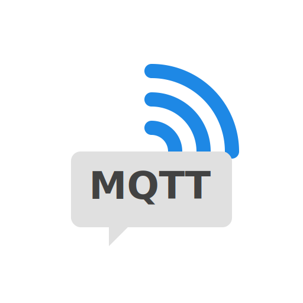
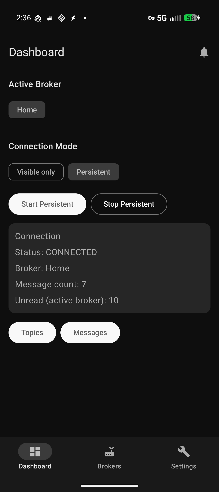
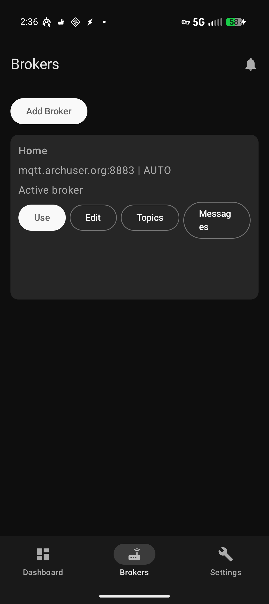
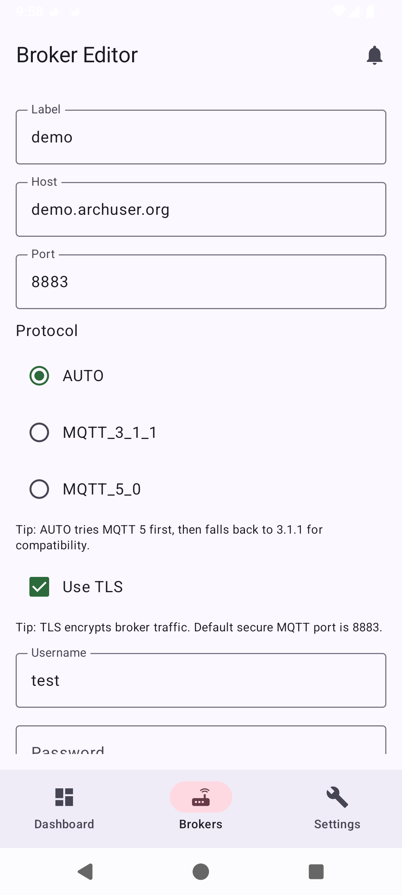
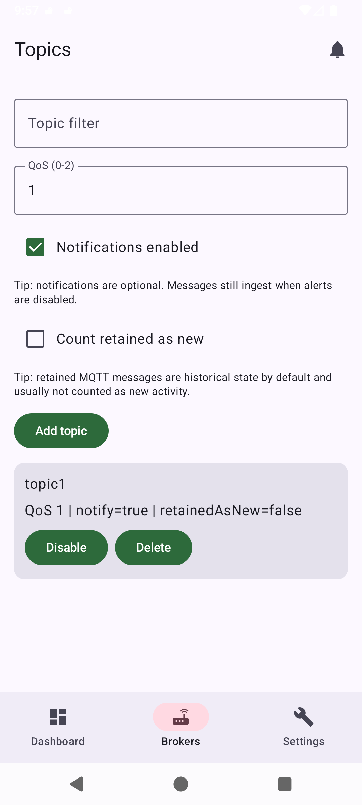
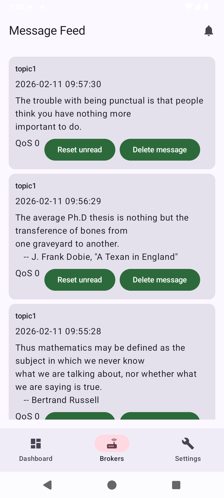
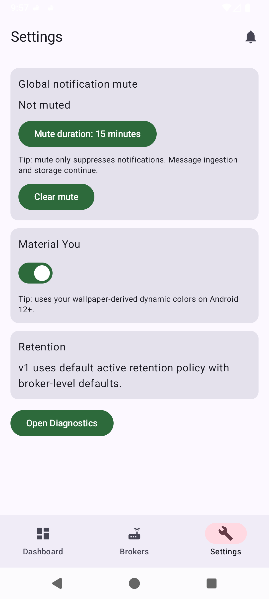
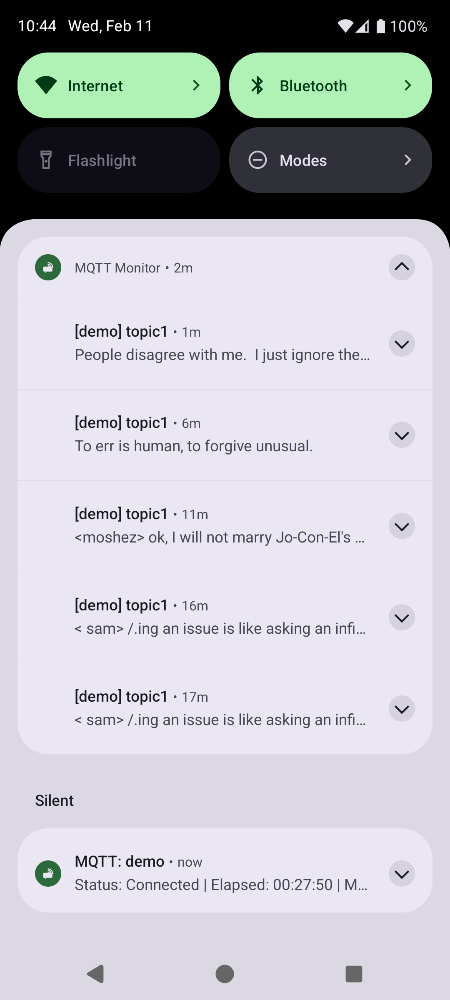

# MQTT Monitor



<p>
  <a href="https://archuser.org/mqttnotify.apk">
    
  </a>
  <a href="https://github.com/firebadnofire/mqttmonitor/releases">
    
  </a>
</p>

## Overview

MQTT Monitor is an Android monitoring terminal for users who run their own MQTT brokers. It is receive-focused, stores inbound messages locally, and can raise per-topic Android notifications while a real MQTT connection is active.

- Application ID: `org.archuser.mqttnotify`
- Current Version: `1.3.1` (versionCode `6`)
- Language: Kotlin
- UI: Jetpack Compose
- Min SDK: 26
- Target/Compile SDK: 36

The app does not claim guaranteed delivery. It exposes Android background tradeoffs directly and gives the user explicit control over when continuous connections are maintained.

## Operating Modes

### Active While Visible (`VISIBLE_ONLY`)

Default and recommended.

- Connects only while the app UI is visible
- Disconnects cleanly when the app backgrounds or the screen session ends
- Generates notifications only while connected

This mode is intended for active monitoring and debugging sessions. It makes no background reliability claims.

### Persistent Foreground (`PERSISTENT_FOREGROUND`)

Optional and off by default.

- Keeps the MQTT connection alive through a foreground service
- Requires an ongoing notification as explicit user consent
- Continues while the screen is off or the app is backgrounded

Delivery remains best-effort and still depends on Android policy, network conditions, and broker availability.

## Current Functional Scope

- Broker management with required connection testing before save
- TLS and username/password authentication support
- MQTT 3.1.1 and 5.0 support
- Topic subscription management with QoS, per-topic notifications, and retained-as-new behavior
- Local per-topic message storage
- Per-message read/unread state and deletion
- Global temporary notification mute
- Diagnostics/event log view
- Foreground-service status notification with live broker, status, elapsed time, and message count

## Notification Model

- Notifications are an alert layer, not the ingestion pipeline
- Per-topic notification enablement is supported
- Global mute suppresses alerts only
- Message ingestion and storage continue while muted if a connection is active
- Retained messages are flagged and do not count as new activity unless enabled per topic

## Broker Rules

- Brokers are stored independently from their display labels
- A broker configuration must pass a connection test before it can be saved
- Invalid or unreachable broker settings are intentionally rejected

## Screens

<details>
<summary>Dashboard</summary>



</details>

<details>
<summary>Broker List</summary>



</details>

<details>
<summary>Broker Editor</summary>



</details>

<details>
<summary>Topic Configuration</summary>



</details>

<details>
<summary>Message Feed</summary>



</details>

<details>
<summary>Settings</summary>



</details>

<details>
<summary>Notifications</summary>



</details>

## Architecture

Main source root: `app/src/main/java/org/archuser/mqttnotify/`

- `connection/`: connection coordinator and mode reconciliation
- `data/local/`: Room entities, DAO interfaces, database
- `data/mqtt/`: MQTT adapter and broker connection testing
- `data/repo/`: repository implementations
- `data/security/`: encrypted credential storage
- `domain/model/`: app domain models
- `domain/repo/`: repository contracts
- `notifications/`: notification channels and dispatch
- `service/`: optional persistent foreground service
- `ui/navigation/`: Compose navigation graph
- `ui/screen/`: Compose screen components
- `ui/viewmodel/`: state/view logic
- `di/`: Hilt bindings

## Build and Test

Build debug APK:

```bash
./gradlew :app:assembleDebug
```

Run unit tests:

```bash
./gradlew :app:testDebugUnitTest
```

Run standard local validation:

```bash
./gradlew :app:testDebugUnitTest :app:assembleDebug
```

## Constraints

- Background delivery is best-effort only
- Foreground mode still depends on Android policy, network reachability, and broker uptime
- Battery optimization can still interfere with background behavior on some devices
- Existing Android notification channel preferences may outlive app reinstalls

## Legal

Copyright (C) 2026 firebadnofire

This project is licensed under the GNU General Public License v3.0.

- SPDX license identifier: `GPL-3.0-only`
- Full license text: [`LICENSE`](LICENSE)
